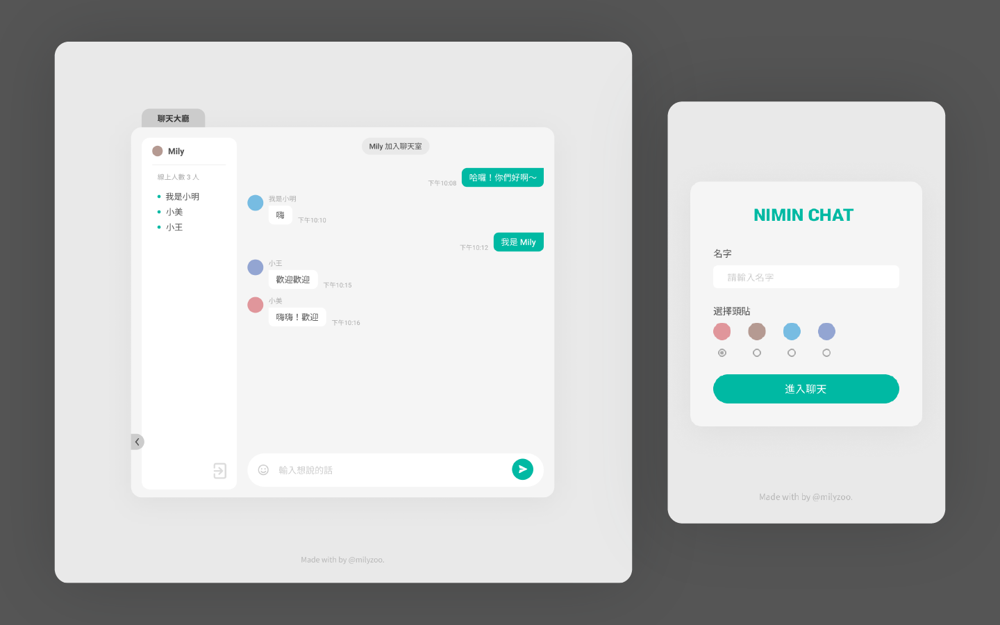
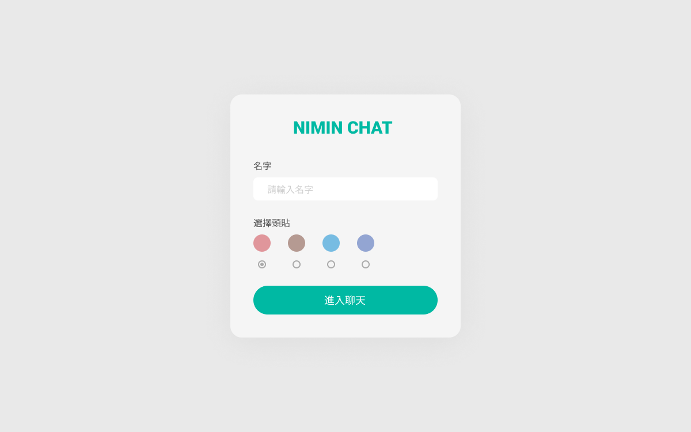
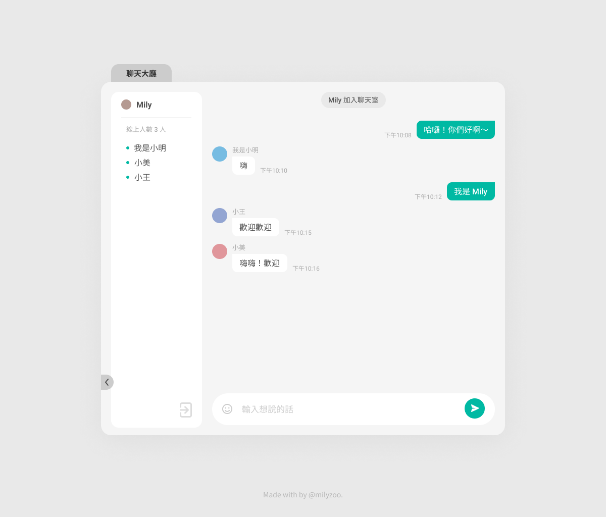
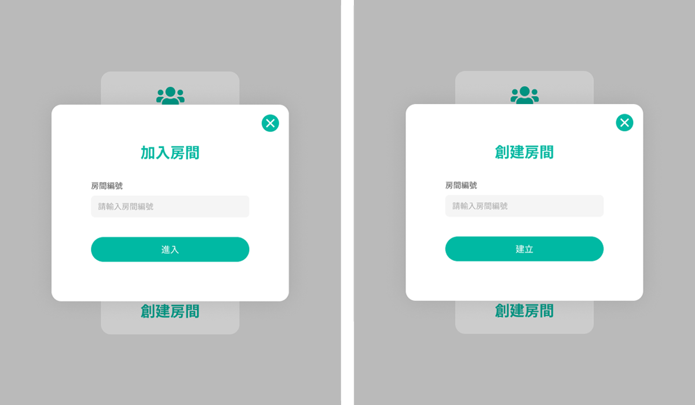

## NiMin Chat
NiMin Chat 為匿名聊天平台，提供使用者抒發心情、輕鬆聊天。

☞ [DEMO](https://milyzoo.github.io/nimin-chat/)



### 待修正項目
此專案仍進行中，以下為待修正之功能：
1. 禁止傳送空白留言
2. 顯示在線使用者
3. 支援表情符號貼圖功能

## 目錄
- [專案功能](#專案功能)
- [使用技術](#使用技術)
- [功能說明](#功能說明)
- [運行專案](#運行專案)

## 專案功能
- 使用者不需進行註冊，即可使用自訂暱稱進入聊天室
- 使用者可自行選擇聊天方式，包含大廳模式、自行建立聊天室房間及加入指定聊天室房間等
- 可以使用內建的表情符號（待製作）

## 使用技術
### 前端
- 以 React 開發，使用 function component 並搭配 Hooks API
- 使用 React Context 管理組件狀態
- 使用 React-router 處理前端路由
- 支援 RWD，使用 styled-components 進行排版
- 搭配 Prettier、ESLint 統一程式碼格式

### 後端
- 使用 Firebase Realtime Database 儲存資料，並即時同步至所連線的用戶端

## 功能說明

### 首頁


### 聊天室介面


### 建立與加入聊天室


## 運行專案
如果要在本機端啟動專案，需先安裝 Node.js 再進行以下步驟。

### 下載專案

將專案下載至本機端。
```
$ git clone https://github.com/milyzoo/nimin-chat.git
```

### 安裝套件
```
$ yarn install
```

### 啟動專案
啟動後，可於任一瀏覽器以 http://localhost:3000 進行結果預覽。
```
$ yarn start
```
